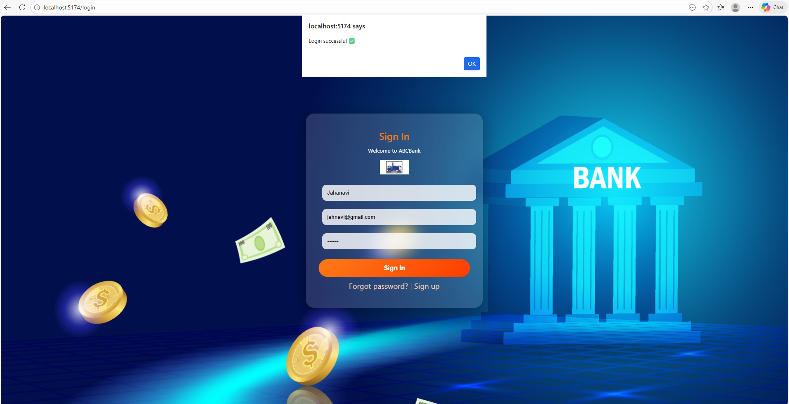
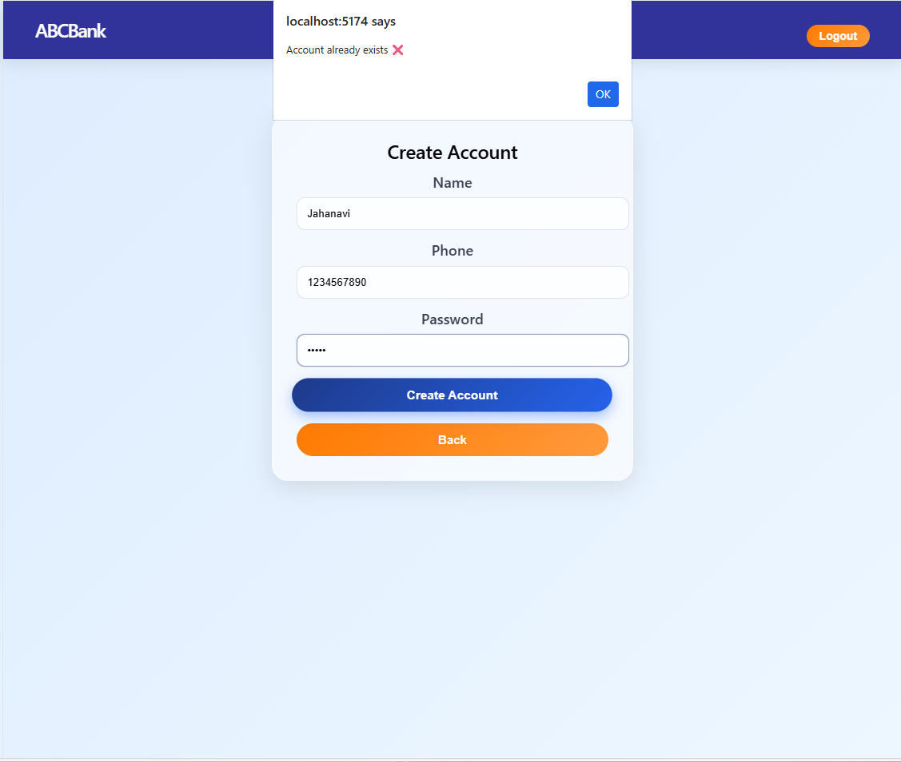
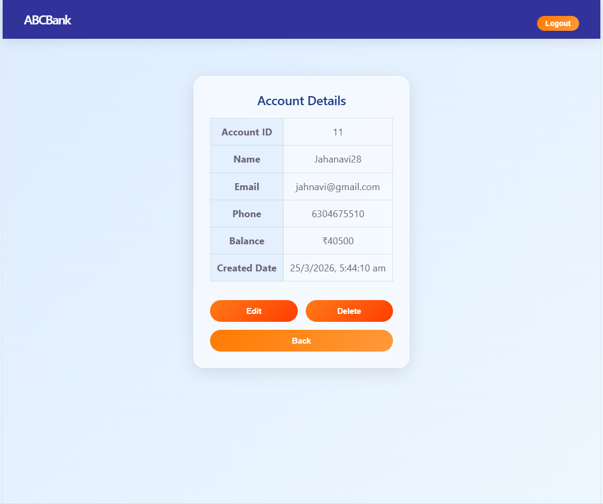
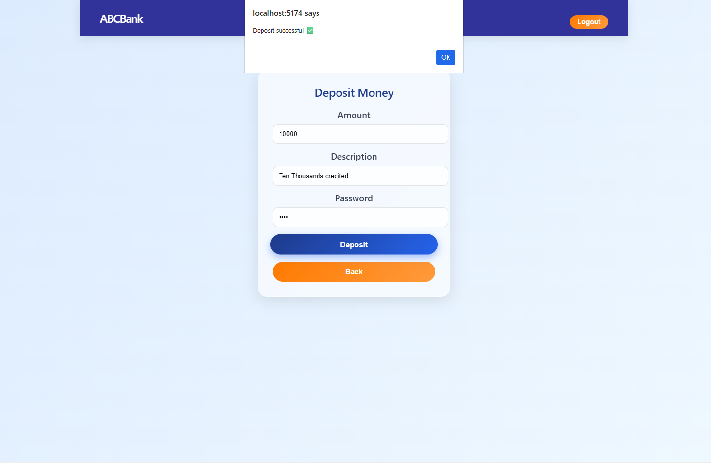
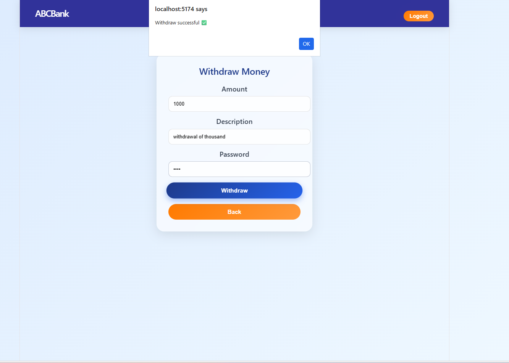
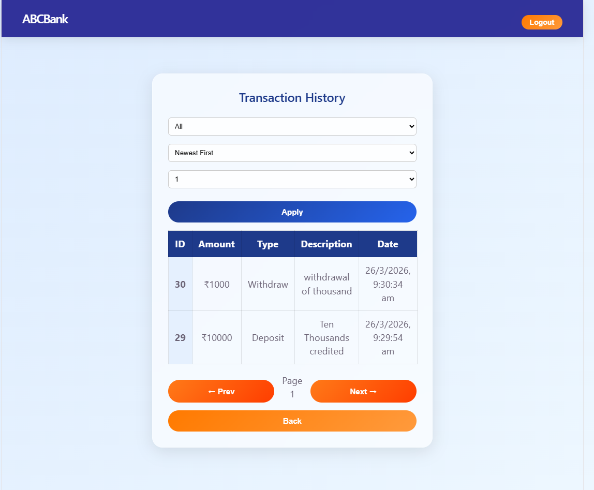
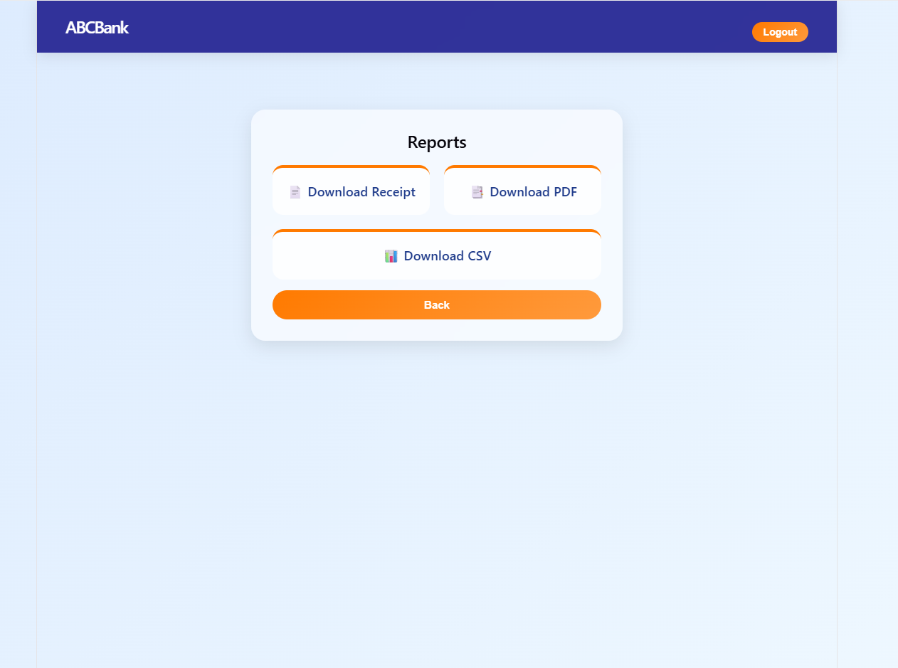

# 💻 ABCBank Frontend – React Application

A modern **Banking UI Dashboard** built using **React.js**.
This frontend application provides a clean and interactive interface for users to log in, register, and manage their banking operations.

---

# 🚀 Features

## 🔐 Authentication UI

* Login with **Email or Username**
* User Registration form
* Error handling with alerts
* Token storage using `localStorage`

## 🏦 Dashboard

* Clean and centered UI
* Card-based navigation menu:

  * ➕ Create Account
  * 👤 View Account
  * 💸 Transactions (UI)
  * 📊 Reports (UI)

## 👤 Account Management UI

* Create account form
* View account details after creation
* Form validation and reset

## 🔄 Navigation

* React Router for page navigation
* Protected Dashboard (based on token)

---

# 🛠️ Tech Stack

* React.js
* React Router DOM
* Axios
* CSS (Custom styling)

---

## 🔐 Authorization
* Login PAge



## 👤 Accounts


* CRUD for Account


## 📑Transactions

* To Deposit Amount with description and password security.



* To Withdraw Amount with description and password security.



* Pagination with filtering and sorting which helps to see a particular records of transactions.



## 📝 Reports



---

# 📁 Project Structure
```
src/
│
├── pages/
│   ├── Login.jsx
│   ├── Register.jsx
│   ├── Dashboard.jsx
│
├── services/
│   ├── api.js
│   ├── authService.js
│
├── styles/
│   ├── Login.css
│   ├── Register.css
│   ├── dashboard.css
│
├── App.jsx
└── main.jsx
```

---

# Setup Instructions

## 1 Install dependencies

```"
npm install
```

## 2 Run the application

```"
npm run dev
```

App will run on:

```"
http://localhost:5173
```

---

# 🔐 Authentication Flow (Frontend)

1. User logs in
2. Token is stored in `localStorage`
3. User is redirected to Dashboard
4. Token is used for API requests

---

# 🎨 UI Highlights

* Centered dashboard layout
* Interactive cards with hover effects
* Clean form design
* Responsive structure (can be extended)

---


# 📌 Future Improvements

* 🔐 Better error UI (toast notifications)
* 📱 Fully responsive design
* 🌙 Dark mode
* 🔔 Notifications
* 📊 Charts for reports

---

# 👩‍💻 Author

**Jahanavi P**


